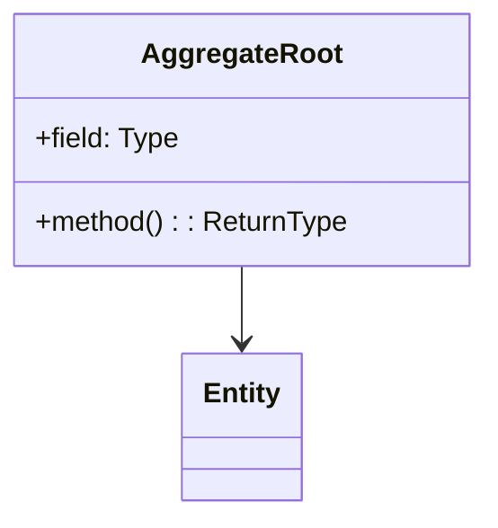
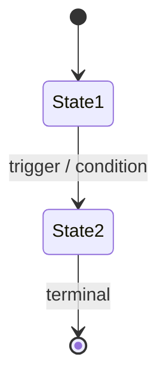

# Domain Model Document Standards

Mandatory conventions governing the internal structure of `memory/mbs-domain-model.md` —
the **single source of truth** for MBS Intelligence Platform domain terminology, bounded
context boundaries, aggregate structures, Knowledge Graph schema contracts, domain events,
and business invariants.

Any agent or developer modifying this document **must preserve these structural rules**.

---

## Document Sections (Required Order)

The domain model uses a fixed top-level section order. New content must be inserted into
the correct section — **never appended to the end or placed between sections**.

| Order | Heading (`##`)                          | Purpose                                                                 |
|-------|-----------------------------------------|-------------------------------------------------------------------------|
| 1     | `## Domain Vision Statement`            | Core platform purpose, core subdomains, and supporting domains          |
| 2     | `## Ubiquitous Language`                | Glossary of MBS and platform terms grouped by topic                     |
| 3     | `## Context Map`                        | Bounded context overview table and dependency diagram                   |
| 4     | `## Bounded Contexts`                   | Detailed definition of each bounded context                             |
| 5     | `## Shared Kernel`                      | Cross-cutting contracts and graph schema primitives imported by all contexts |
| 6     | `## Cross-Cutting Concerns`             | Architectural constraints that span multiple contexts                   |
| 7     | `## How Specifications Reference This Model` | Governance rules for feature specs                                 |

---

## Heading Hierarchy

The document uses **exactly three heading levels**:

| Level  | Usage                                                                  | Example                                        |
|--------|------------------------------------------------------------------------|------------------------------------------------|
| `##`   | Top-level sections (listed above)                                      | `## Bounded Contexts`                          |
| `###`  | Bounded contexts, Ubiquitous Language topic groups, Cross-Cutting Concern topics | `### Loan Tape Ingestion Context`, `### Graph Metrics` |
| `####` | Subsections within a bounded context or cross-cutting concern          | `#### State Machines`, `#### Domain Events`, `#### Data Types` |

### Good Example

```
## Bounded Contexts

### Loan Tape Ingestion Context
(aggregates, entities, value objects, invariants)

#### State Machines
(state diagrams owned by this context)

#### Domain Events
(events published by this context)

### Fraud Intelligence Context
(aggregates, entities, value objects, invariants)
```

### Bad Example

```
## Bounded Contexts

### Loan Tape Ingestion Context
(aggregates, entities, value objects, invariants)

## State Machines          ← Wrong: standalone top-level section
### Loan Status            ← Wrong: state machine not inside its owning context

## Domain Events           ← Wrong: standalone top-level section
### TapeIngested           ← Wrong: events not inside their publishing context
```

---

## Bounded Context Internal Structure

Each bounded context (`### Context Name`) follows a fixed internal layout.
Omit subsections that do not apply to the context.

| Order | Content                                                                          | Required                                  |
|-------|----------------------------------------------------------------------------------|-------------------------------------------|
| 1     | **Responsibility** statement and **Service** assignment                          | Yes                                       |
| 2     | **Class diagram** (Mermaid `classDiagram`)                                       | Yes                                       |
| 3     | **Aggregate definitions** — component tables with fields, types, and descriptions | Yes                                       |
| 4     | **Invariants** — bulleted list of business rules and KG constraints              | Yes                                       |
| 5     | `#### State Machines` — Mermaid `stateDiagram-v2` for each entity with a status lifecycle | Only if the context owns stateful entities |
| 6     | `#### Domain Events` — tables of events published by this context                | Only if the context publishes events       |
| 7     | `#### Neo4j Node Labels & Relationship Types` — KG schema contracts owned by this context | Only if the context defines graph nodes   |
| 8     | Horizontal rule (`---`) separating from the next context                         | Yes (except last context)                 |

### Canonical Bounded Context Template

````markdown
### [Context Name] Context

**Responsibility**: [Single sentence describing what this context owns and decides.]
**Owning Service / Module**: [e.g., `loan_tape_pipeline`, `fraud_intelligence_network`]



**[AggregateRoot Name]** — `[AGGREGATE]`

| Field              | Type      | Description                                      |
|--------------------|-----------|--------------------------------------------------|
| `fieldName`        | `String`  | What this field represents in the MBS domain     |

**Invariants**

- Invariant 1 — expressed as a falsifiable business rule.
- Invariant 2 — KG constraint (e.g., no Broker node may exist without an NMLS ID).

#### State Machines

**[Entity] Status**



#### Domain Events

| Event Name                  | Trigger                                      | Published To              |
|-----------------------------|----------------------------------------------|---------------------------|
| `LoanTapeIngested`          | Tape passes field normalization              | Fraud Intelligence Context|

#### Neo4j Node Labels & Relationship Types

| Label / Rel Type        | Properties                          | Owned By This Context |
|-------------------------|-------------------------------------|-----------------------|
| `(:Loan)`               | `loanId, fico, ltv, dti, upb`       | Yes                   |
| `[:ORIGINATED_BY]`      | `originationDate`                   | Yes                   |

---
````

---

## Colocation Rules

- **State machines** belong inside the bounded context that owns the stateful entity.
  A `LoanStatus` state machine goes under `### Loan Tape Ingestion Context > #### State Machines`,
  not in a standalone `## State Machines` section.

- **Domain events** belong inside the bounded context that publishes them.
  Events published by the Fraud Intelligence Context go under
  `### Fraud Intelligence Context > #### Domain Events`,
  not in a standalone `## Domain Events` section.

- **Neo4j node labels and relationship types** belong inside the bounded context that
  semantically owns the entity. A `(:Broker)` node is owned by the Fraud Intelligence Context,
  not declared in a global graph schema section.

- **Never create standalone top-level sections (`##`)** for state machines, domain events,
  KG schema, or any other content that belongs inside a specific bounded context.

### Good Example — Adding a State Machine

```
### Fraud Intelligence Context
(existing aggregates, entities, invariants)

#### State Machines

**Broker Risk Score Status**
(existing state diagram)

**Fraud Investigation Status**           ← Correct: added inside the owning context
(new state diagram)
```

### Bad Example — Adding a State Machine

```
## Entity State Machines               ← Wrong: new top-level section

**Fraud Investigation Status**         ← Wrong: not inside the owning context
(new state diagram)
```

---

## Inserting New Content

### New Bounded Context

Insert new bounded contexts **alphabetically by name** within `## Bounded Contexts`.
Follow the internal structure template defined above. Also add the new context to:

1. The Context Map table in `## Context Map`
2. The Bounded Context Dependencies diagram if it has cross-context relationships
3. The `## Shared Kernel` if it introduces new shared graph schema contracts

### New Aggregate, Entity, or Value Object

Add within the correct bounded context's aggregate definition section,
following the existing component table format.

### New Invariant

Append to the **Invariants** bulleted list within the correct bounded context.
Invariants must be falsifiable — write them as rules that can fail, not aspirations.

### New State Machine

Add under the `#### State Machines` heading within the owning bounded context.
If the context does not yet have a `#### State Machines` subsection, create it after
the Invariants section and before `#### Domain Events`
(or before the horizontal rule if no events exist).

### New Domain Event

Add to the event table under `#### Domain Events` within the publishing bounded context.
Group events by category using bold subheadings (e.g., **Ingestion Events**,
**Fraud Alert Events**, **Monitoring Events**).
If the context does not yet have a `#### Domain Events` subsection, create it after
`#### State Machines` (or after Invariants if no state machines exist) and before the
horizontal rule.

### New Neo4j Node Label or Relationship Type

Add a row to the `#### Neo4j Node Labels & Relationship Types` table within the
bounded context that semantically owns the entity.
If the node label is shared across multiple contexts (e.g., `(:Property)`),
declare it in `## Shared Kernel` under the **Graph Schema Contracts** subsection.

### New Cross-Cutting Concern

Add as a new `###` subsection within `## Cross-Cutting Concerns`, after existing subsections.

### New Ubiquitous Language Term

Add to the appropriate `###` topic group within `## Ubiquitous Language`.
If no existing group fits, create a new `###` group in logical order among the existing groups.

### New Shared Kernel Contract

Add a row to the table within `## Shared Kernel`.

---

## Bounded Context Registry

The MBS Intelligence Platform defines the following bounded contexts.
New contexts must be approved before being added (see Governance).

| Bounded Context                     | Owning Module                  | Core Aggregate(s)                         |
|-------------------------------------|--------------------------------|-------------------------------------------|
| Loan Tape Ingestion Context         | `loan_tape_pipeline`           | `LoanTape`, `Loan`, `Originator`          |
| Fraud Intelligence Context          | `fraud_intelligence_network`   | `BrokerRiskProfile`, `FraudCase`, `Appraiser` |
| Post-Securitization Monitoring Context | `early_warning_engine`      | `Pool`, `EarlyWarningAlert`, `MacroCycleSnapshot` |
| Knowledge Graph Context             | `neo4j_kg_service`             | `GraphNode`, `GraphRelationship`          |

---

## Ubiquitous Language — Topic Group Registry

The `## Ubiquitous Language` section organizes terms into the following `###` topic groups.
New terms go into the most appropriate existing group:

| Topic Group                    | Covers                                                        |
|--------------------------------|---------------------------------------------------------------|
| `### Loan Attributes`          | FICO, DTI, LTV, CLTV, UPB, WAC, WAM, WALTV, Documentation Type, Occupancy |
| `### Pool & Securitization`    | Pool, CDR, CPR, WAL, Tranche, Waterfall, CE, OC, Excess Spread |
| `### Fraud & Risk Signals`     | EPD, AVM Gap, Broker-Appraiser Co-Occurrence, SAR, FinCEN, Stacking |
| `### Graph Network Metrics`    | Louvain Community ID, PageRank, Node Centrality, Community Detection |
| `### Macro Intelligence`       | HPA, MSA, FHFA HPI, FRED, FFR, FOMC, FEMA Flood Zone, LAUS   |
| `### Servicing & Performance`  | Delinquency Bucket, Roll Rate, REO, Modification, Forbearance, Realized Loss |
| `### Standards & Compliance`   | MISMO, NMLS, Reg AB, REMIC, PSA, FinCEN, R&W, TPDD           |

---

## Shared Kernel — Scope Rules

The `## Shared Kernel` contains **only** contracts that are:

1. Consumed by **two or more bounded contexts** without transformation
2. **Stable** — changing them requires cross-context coordination
3. **Graph schema primitives** that define the foundational KG topology

The Shared Kernel is **not** a dumping ground for anything globally useful.
If a contract is only used by one context, it belongs in that context.

---

## Cross-Cutting Concerns — Required Topics

The `## Cross-Cutting Concerns` section must always include the following `###` topics:

| Topic                              | Content                                                        |
|------------------------------------|----------------------------------------------------------------|
| `### Knowledge Graph Architecture` | Neo4j schema design principles, GDS plugin constraints, index strategy |
| `### MISMO Field Normalization`    | Standards mapping rules, field aliasing conventions            |
| `### Human-in-the-Loop (HITL) Protocol` | Which decisions require human approval before system action |
| `### Data Source Integration`      | Free/licensed data source contracts (FRED, FHFA, Freddie Mac, CFPB HMDA) |
| `### Fraud Decision Audit Trail`   | Immutability rules for fraud-related KG writes                |

---

## Version Numbering

The document header contains a version number (`**Version**: X.Y.Z`).
Update it whenever the document is modified:

| Change Type                                                                        | Bump  | Example                  |
|------------------------------------------------------------------------------------|-------|--------------------------|
| New bounded context or removal of existing context                                 | Major | `1.5.0 → 2.0.0`         |
| New aggregate, entity, state machine, event, invariant, KG node/rel, or cross-cutting concern | Minor | `1.5.0 → 1.6.0` |
| Typo fix, wording clarification, formatting correction — no semantic change        | Patch | `1.5.0 → 1.5.1`         |

Always update the `**Last Amended**` date to the current date when changing the version.

---

## Governance

Changes to the domain model follow the same governance process as architecture decisions:

- Document all structural changes in an Architecture Decision Record (`architecture/adr/`)
- Changes to `## Bounded Contexts`, `## Shared Kernel`, or `## Cross-Cutting Concerns` must
  be reviewed before ratification — do not merge without a second review pass
- Feature specifications and build components reference this model but **do not redefine its terms** —
  if a term needs updating, update it here and nowhere else
- The `## How Specifications Reference This Model` section defines how build component specs,
  Cypher schema files, and pipeline configs interact with the model — do not modify or remove
  this section without team review
- **No new Neo4j node label or relationship type may be introduced in code** before it is
  declared in this document. The domain model leads; the implementation follows.
- Fraud-related invariants and HITL rules are **locked** — they may only be relaxed by
  explicit ADR with documented business justification

---

*MBS Intelligence Platform — Domain Model Document Standards*
*Adapt this instruction document when the platform scope or bounded context registry changes.*
